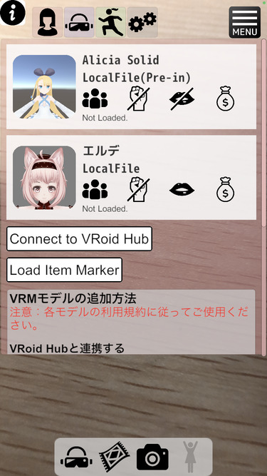
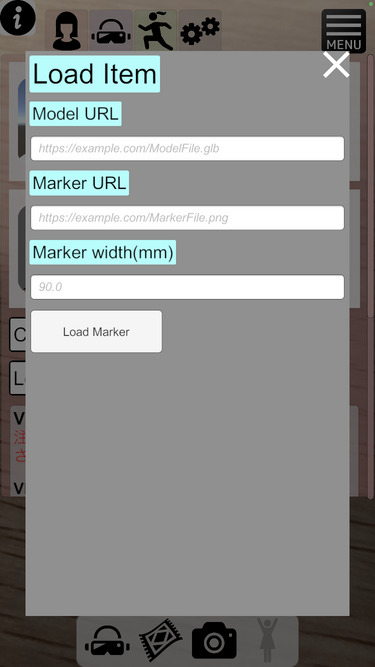

# How to load items / アイテムのロード方法
## Select laungage / 言語選択
- [#English](#English) (work in progress)
- [#日本語](#日本語)

## English
## How to load items - Method 1
1. Upload the corresponding 3D model in GLB format to the web.
    - The app must be available to download and use from the website.
    - Example:Upload to Google Drive to get a shared link
    - If you want to try it out, please use this QR code image.  
        
    - (Thanks to  Momoma's [low-poly capybara](https://booth.pm/ja/items/1145634).)
1. Start the V date application and call up the character.
1. View the prepared QR code on the camera. Be aware of the following:
    - Hold the QR code until the model is displayed.
    - It is recommended to put it on a desk. I don't recommend having one.
    - Reflect the QR code from various angles, not just one direction.
    - (The reason for these is to measure the physical size of the QR code during import.)
1. When the model is displayed, you can move the QR code to any position.
    - You can use it to guide your eyes, so please try it.

## How to Load Items - Method 2 (Version 2.8.0 and Later)

By preparing a configuration file and an image in advance, you can now use any image as a marker to call up items instead of using QR codes!   
Create a directory named `Items` in the app's dedicated directory (the same directory where VRM models are stored), and place a `markers.json` file (format described below) along with the images you want to use as markers in it.

### Format of `markers.json`

An array of associative arrays containing the following elements:

| Field Name           | Type    | Required | Description                                       | Constraints         |
|----------------------|---------|----------|---------------------------------------------------|---------------------|
| `modelURI`          | string  | Yes      | File name or URL of the 3D model (`file:/[filename]`, `https://[URL]`)                               | Must be a valid filename or URL　(filename is available in ver. 2.10.1 and later) |
| `markerURI`         | string  | Yes      | File name or URL of the marker image (`file:/[filename]`, `https://[URL]`) | Must be a valid filename or URL |
| `physicalWidthSize` | number  | Yes      | Physical width of the marker image (unit: meters) | Must be greater than 0 |

Example:
```json
[
  {
    "modelURI":"https://drive.google.com/uc?id=1VgElqAIil4MGAHBkn1AGYUYHPCDQH4Nj",
    "markerURI":"file:/CapybaraMarker.jpg",
    "physicalWidthSize": 0.1
  }
]
```

### Reference Files
Sample files are provided at the link below. Please download and extract them for use:  
[https://hiirohitoyo.github.io/VDateNowInstructions/ItemMarkerSample.zip](https://hiirohitoyo.github.io/VDateNowInstructions/ItemMarkerSample.zip)

## How to Load Items - Method 3 (Version 2.9.0 and Later)
Instead of preparing a `markers.json` file, you can now load items directly within the app using the following steps.  
When loaded this way, the settings are not saved and are only valid while the app is running.

1. Press the "Load Item Marker" button at the bottom of the model selection screen.  
   
2. On the "Load Item" screen, enter the URL of the model file, the URL of the marker file, and the physical width of the marker image (in mm).  
   (From ver. 2.10.1 and later) You can also specify a local file URI instead of a URL (selectable via the Select from File button).  
   
3. Press the "Load Marker" button.

## 日本語
## アイテムのロード方法 その１
- 動画での説明はこちらです。（手順1,2後の説明） [https://youtu.be/Fpb5nilpZlE](https://youtu.be/Fpb5nilpZlE)


1. 対応するGLB形式の3Dモデル（作り方は後述）をWebにアップロードします。
    - アプリがそのWebサイトからダウンロードして利用するため、アプリからアクセスが可能になっている必要があります。
    - 例：Google Drive にアップロードして共有リンクを取得する  
    （注：Google Driveサイトで取得できるリンクはビュアーページのURLなので、ファイル直接のリンクに修正する必要があります。[参考サイト](https://qiita.com/rot-z/items/299ac40361690c51ce1d)）
1. 1でアップロードしたファイルのURLをQRコードにします。
    - QRコードを作成する場合は装飾等を行わないようにしてください。
    - 推奨のQRコード作成サイト: [https://qr.quel.jp](https://qr.quel.jp)
    - とりあえず試したい方はこちらのQRコード画像を利用してください。   
      
    （momoma氏作の[ローポリカピバラ](https://booth.pm/ja/items/1145634)を改変して使わせていただきました）
1. Vデートなうアプリを起動し、キャラクターを呼び出します。
1. 準備したQRコードをカメラに映します。この際以下の点の注意してください。
    - モデルが表示されるまでQRコードを静止させてください。
      - 机の上に置くなどを推奨します。手持ちは非推奨です。
    - １方向だけでなく色々な角度からQRコードを映してください。
    - （これらの理由は、読み込み時にQRコードの物理的な大きさを測定するためです）
1. モデルが表示されたらQRコードを好きな位置に移動させることでアイテムの場所を移動させることができます。  
視線の誘導にも使えるので試してみてください。

## アイテムのロード方法 その２（ver2.8.0以降）
設定ファイルと画像を事前に用意することで、QRコードの代わりに任意の画像をマーカーにしてアイテムを呼び出すことができるようになりました！  
アプリの固有ディレクトリ（VRMモデルなどを入れているディレクトリがあるディレクトり）にItemsというディレクトリを作成し、そこにmarkers.jsonというファイル（フォーマットは後述）と、マーカーにしたい画像を入れてください。

### markers.jsonのフォーマット
以下の要素を持つ連想配列の配列。

| フィールド名           | 型      | 必須 | 説明                                           | 制約              |
|------------------------|---------|------|------------------------------------------------|-------------------|
| `modelURI`            | string  | はい | 3Dモデルのファイル名もしくはURL（`file:/[ファイル名]`, `https://[URL]`）                                  | 有効なファイル名もしくはURLであること（ファイル指定はver2.10.1以降で可能） |
| `markerURI`           | string  | はい | マーカー画像のファイル名もしくはURL（`file:/[ファイル名]`, `https://[URL]`）                        | 有効なファイル名もしくはURLであること |
| `physicalWidthSize`   | number  | はい | マーカー画像の物理幅（メートル単位）             | 0より大きな値         |


例：
```json
[
  {
    "modelURI":"https://drive.google.com/uc?id=1VgElqAIil4MGAHBkn1AGYUYHPCDQH4Nj",
    "markerURI":"file:/CapybaraMarker.jpg",
    "physicalWidthSize": 0.1
  }
]
```

### 参考ファイル
以下に参考ファイルを配置したので、ダウンロード＆解凍して使ってください。
[https://hiirohitoyo.github.io/VDateNowInstructions/ItemMarkerSample.zip](https://hiirohitoyo.github.io/VDateNowInstructions/ItemMarkerSample.zip)

## アイテムの消去方法
- 出現させたアイテムを消す機能は現在未実装です。  
申し訳ないですが、アプリの再起動をお願いいたします。

## 読み込み対応3Dモデルの作成方法
- マテリアルとしてMTOONを使い、UniVRMのExportGLB機能を使ってエクスポートします。

## アイテムのロード方法 その３（ver2.9.0以降）
markers.jsonを用意する代わりに、以下の手順でアプリ上で読み込むことが可能です。  
この方法で読み込んだ場合、設定は保存されず、アプリの動作中のみ有効です。

1. モデル選択画面最下部の「Load Item Marker」ボタン押下する  
   
2. Load Item 画面でモデルファイルのURL、マーカーファイルのURL、マーカー画像の物理幅（mm単位）を入力する  
   （ver2.10.1以降） URLの代わりにローカルファイルのURIも指定できます（Select from Fileボタンから選択可能です）  
   
3. Load Markerボタンを押下する
